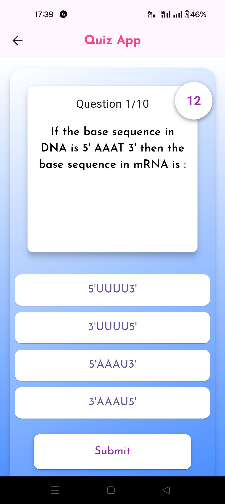
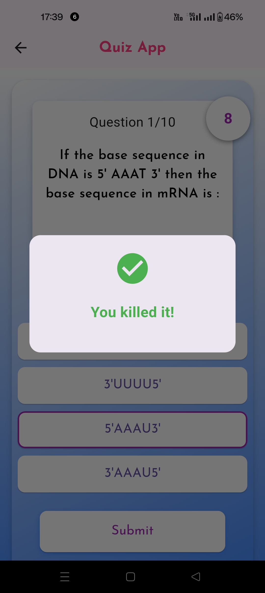
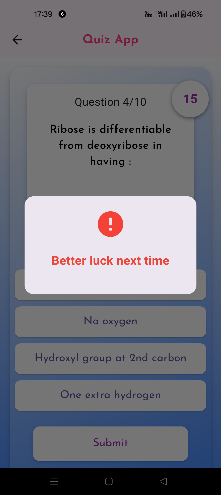

# Flutter Quiz App

A simple quiz app built with Flutter.

## Features

- Display multiple-choice questions with options.
- Track user score.

## Prerequisites

Make sure you have Flutter and Dart installed on your system. You can check the installation guide here: [Flutter Installation Guide](https://flutter.dev/docs/get-started/install)

- Flutter 3.x.x or later
- Dart 2.x.x or later
- Android Studio or Visual Studio Code with Flutter plugin (optional)

## Setup Instructions

### 1. Clone the repository

```bash
git clone "Link"
cd flutter-quiz-app
```

### 2. Install dependencies

In your project directory, run the following command to get all the dependencies:

```bash
flutter pub get
```

### 3. Run the app

Make sure your emulator or device is connected, then run the following command:

```bash
flutter run
```

### 4. Testing

You can run tests with:

```bash
flutter test
```

---
## Ui of the app

### Get Started Page:


### Questions Page:


### Right Answer pop up:



### Wrong Answer Pop up:



### Result Page:


## App Walkthrough and features videos:
https://drive.google.com/drive/folders/1lXbwhNSpsPaVi_USql99mVbfhKfO-xE4?usp=sharing

